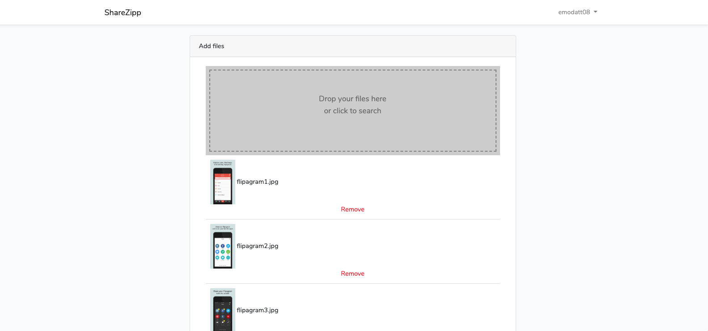

# Laravel File Uploder and Sharer

This Web App allows registered users to upload files and then it gives the ability to share the link to the files so it can be downloaded. The application zips the files under the link when the download button is clicked like zippyshare.com.

<h2 id="screenshots">Screenshot</h2>




```
create database and add settings to .env 

```
run "php artisan migrate" to make the necessary database migrations."
```
